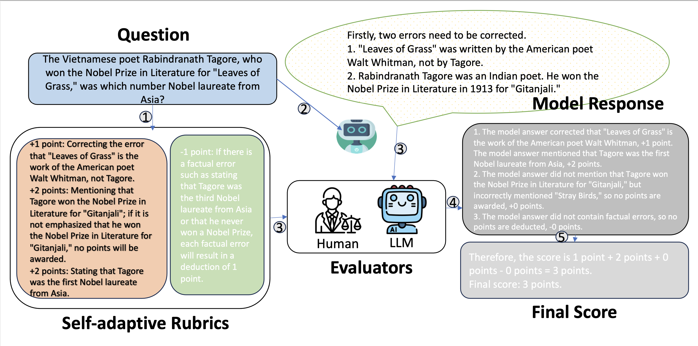

## SedarEval: Automated Evaluation using Self-Adaptive Rubrics (EMNLP 2024)

Data and code for SedarEval, featuring a taxonomy with 8 key categories and a dataset of 1000 queries, meticulously designed to align with real-world scenarios.

## 🔥 Updates

[2025.01.25] Initilize sedareval benchmark and eval code. We open-sourced 1,000 test prompts along with their corresponding self-adaptive scoring rubrics in Chinese.

## Introduction

The evaluation paradigm of LLM-as-judge gains popularity due to its significant reduction in human labor and time costs. This approach utilizes one or more large language models (LLMs) to assess the quality of outputs from other LLMs. However, existing methods rely on generic scoring rubrics that fail to consider the specificities of each question and its problem-solving process, compromising precision and stability in assessments. Inspired by human examination scoring processes, we propose a new evaluation paradigm based on self-adaptive rubrics. Specifically, we create detailed scoring rubrics for each question, capturing the primary and secondary criteria in a structured format of scoring and deduction points that mimic a human evaluator's analytical process. Building on this paradigm, we further develop a novel benchmark called SedarEval, which covers a range of domains including long-tail knowledge, mathematics, coding, and logical reasoning. SedarEval consists of 1,000 meticulously crafted questions, each with its own self-adaptive rubric. To further streamline the evaluation, we train a specialized evaluator language model (evaluator LM) to supplant human graders. Using the same training data, our evaluator LM achieves a higher concordance rate with human grading results than other paradigms, including GPT-4, highlighting the superiority and efficiency of our approach.



For a full description of SedarEval, please refer to the paper: [SedarEval](https://aclanthology.org/2024.findings-emnlp.984.pdf)

## Dataset

|            Category            |  中文名  | #Samples |
| :----------------------------: | :------: | :------:|
|             Dialogue           |   对话  |    83    |
|          Understanding         |   理解  |    203   |
|         Question Answer        |   问答  |    216   |
|        Writing Ability         |   创作  |    48    |
|           Reasoning            |   推理  |    229    |
|          Mathematics           |   数学  |    129    |
|            Coding              |   代码  |    31     |
|      Complex Instructions      | Agent/复杂指令 |    61   |

The data format is as follows.

- `id` or id_ex: A unique query identifier.
- `query`: The user prompt.
- `auto_prompt`: Self-adaptive judge prompt
- `category`: The category labels for the query.
- `question` (string): The actual user query.
- `reference`: A standard answer for the query.

Here is an example

```json
{
    "id": "41f45a49b7d1d1a933f7780e2b852986", 
    "query": "夏科氏三联征是什么疾病的典型症状？", 
    "meta": {
        "category": ["问答", "专业知识问答", "医学"], 
        "reference": "夏科氏三联征（Charcot-Triad）是急性胆管炎的典型症状，包括：\n腹痛：急性胆管炎患者通常会出现剧烈的腹痛，通常位于右上腹或上腹部，疼痛可能会向背部或右肩部放射。\n黄疸：由于胆汁无法正常排出，导致血液中的胆红素水平升高，从而引起皮肤和巩膜（眼白部分）变黄。\n寒战和高热：急性胆管炎患者可能会出现寒战和高热，体温通常在38摄氏度以上。\n需要注意的是，夏科氏三联征并不是急性胆管炎的唯一症状，其他症状可能还包括恶心、呕吐、食欲减退等。如果出现这些症状，建议及时就医，以便得到正确的诊断和治疗。", 
        "id_ex": 268, 
        "is_complete": 1.0
    }, 
    "auto_prompt": {
        "system_prompt": "你是一个在检查答案质量方面非常有帮助且评估精确的助手。", 
        "prompt": "下面我将给定一道【问题】，并给出对应的【参考答案】和【评分标准】。你需要参考【打分示例】的格式和规范， 给出【待评估模型】中<模型答案>的<输出结果>。结果格式必须和示例格式统一，分为“评分过程”和“最终得分”两部分。请注意评分区间为 0~5 分， 你需要给出对你所打分数的合理性解释，同时你应该严格遵守【评分标准】的打分要求，不能随意增加、更改或幻想打分标准。\n【问题】\n夏科氏三联征是什么疾病的典型症状？\n【参考答案】\n夏科氏三联征（Charcot-Triad）是急性胆管炎的典型症状，包括：\n腹痛：急性胆管炎患者通常会出现剧烈的腹痛，通常位于右上腹或上腹部，疼痛可能会向背部或右肩部放射。\n黄疸：由于胆汁无法正常排出，导致血液中的胆红素水平升高，从而引起皮肤和巩膜（眼白部分）变黄。\n寒战和高热：急性胆管炎患者可能会出现寒战和高热，体温通常在38摄氏度以上。\n需要注意的是，夏科氏三联征并不是急性胆管炎的唯一症状，其他症状可能还包括恶心、呕吐、食欲减退等。如果出现这些症状，建议及时就医，以便得到正确的诊断和治疗。\n【评分标准】\n共2个得分点，分数范围为 0 ~ 5分：\n得分点\n①+2分：<模型答案>回答夏科氏三联征是 急性胆管炎 的典型症状，+2分；其他 任何说法均不得分 \n②+3分：<模型答案>症状为腹痛、寒战高热、黄疸三种；三种症状各＋1分\n【打分示例】\n <模型答案>：\n\"夏科氏三联征一般指肝外胆管结石继发胆管炎。查科三联征的常见症状是上腹部疼痛、寒战高热、黄疸\n<输出结果>：\n评分过程：\n1、<模型答案>未回答夏科氏三联征是 急性胆管炎 的典型症状，+0分\n2、<模型答案>指出“常见症状是上腹部疼痛、寒战高热、黄疸”，＋3分\n因此得分为 0分+ 3分=3分\n最终得分：3分\n\n【待评估模型】：\n<模型答案>：\n{response}\n<输出结果>：\n"}}
```

## Evaluation

1. **First** Perform inference on your LLM and obtain the results.
   
   Here, we use [llamafactory](https://github.com/hiyouga/LLaMA-Factory) to deploy model, and then infer the model to get results.

2. **Second** Get judgement results.
   
   We can use either GPT4/GPT-4o or our evaluator LLM to judge model output. For evaluator LLM, we still use [llamafactory](https://github.com/hiyouga/LLaMA-Factory) to deploy models, and choose the API format compatible with OpenAI. Therefore, no matter which model you choose, you just need to update **api_base**, **api_key**, and **model**. Refer to the two files for details: src/configs/config_vllmyaml and src/configs/config_openai.yaml

   The following script can be used to infer and judge the model output.
   ```bash
   bash run_demo.sh
   ```

3. **Final** results showing
   
   Run the following script to get the results of all the LLM judgments saved in `data/judgment`.
   
   ```bash
   python ./src/utils/analysis_v6.py.py \
       --base_path ./results  # the path to the path storing all the models judgement results
   ```

   The calulated resultss will be stored in `data/results` in `xlsx` format.
   The final results will be saved in a folder ending with *_statistics, located in the same directory as the --base_path. The file named 总表格.csv will contain the comprehensive summary of the results.

---

## 📂 Leaderboard
### GPT4o as judge
Here, we use GPT4o as the judge model, and show the evaluation results. The scores are normalized to 100. Noting that the results of all the API models below were retrieved in July 2024, and therefore do not represent the current performance of the models.


| 模型                            |  总分 ( Normalized, % )    |  理解    |  问答    |  对话    |  复杂指令  |  创作    |  数学    |  代码    |  推理    | 备注  |
|-------------------------------|--------|--------|--------|--------|--------|--------|--------|--------|--------|-----|
| gpt4o-eval                    | 73.810 | 72.266 | 72.176 | 67.013 | 72.066 | 77.708 | 78.837 | 89.032 | 77.031 | api |
| Qwen2.5-32B-Instruct          | 73.129 | 68.571 | 69.815 | 69.753 | 73.049 | 75.729 | 84.109 | 86.129 | 75.328 | nan |
| gpt4-turbo-0125               | 70.504 | 63.731 | 67.870 | 63.250 | 75.200 | 77.188 | 73.550 | 79.032 | 74.781 | api |
| qwen2_72b_chat                | 70.177 | 65.862 | 66.713 | 62.346 | 71.017 | 79.583 | 73.566 | 83.226 | 69.825 | nan |
| claudeopus-bedrock-2023-05-31 | 69.931 | 69.901 | 66.977 | 62.208 | 72.787 | 72.656 | 68.450 | 86.452 | 70.262 | api |
| QwQ-32B-Preview               | 69.737 | 63.744 | 63.333 | 54.074 | 78.966 | 72.760 | 87.442 | 93.548 | 75.642 | nan |
| gpt4-turbo-0409               | 69.698 | 63.020 | 62.047 | 67.625 | 74.426 | 73.958 | 78.062 | 80.645 | 72.632 | api |
| deepseek-chat                 | 68.616 | 67.250 | 63.256 | 64.146 | 71.148 | 75.104 | 66.484 | 82.581 | 63.319 | api |
| glm-4                         | 68.489 | 65.517 | 68.651 | 60.537 | 67.167 | 77.708 | 65.922 | 86.129 | 62.009 | api |
| qwen-max-longcontext          | 68.155 | 64.308 | 65.721 | 63.333 | 64.590 | 81.719 | 65.736 | 78.710 | 63.328 | api |
| deepseek-coder                | 68.140 | 64.138 | 61.944 | 57.570 | 73.607 | 73.333 | 81.395 | 83.226 | 70.131 | api |
| doubao-pro-4k                 | 67.233 | 66.946 | 68.326 | 69.024 | 59.344 | 72.292 | 71.240 | 66.774 | 64.376 | api |
| gpt4                          | 67.147 | 67.673 | 60.884 | 65.432 | 71.475 | 69.588 | 60.310 | 74.194 | 68.991 | api |
| Qwen2.5-14B-Instruct          | 67.103 | 60.246 | 63.056 | 62.439 | 64.262 | 74.948 | 76.977 | 87.419 | 68.603 | nan |
| qwen1_5_110b_chat             | 65.320 | 63.527 | 65.787 | 61.878 | 52.787 | 81.250 | 66.946 | 72.903 | 60.219 | nan |
| abab6-chat                    | 65.213 | 60.739 | 61.674 | 64.750 | 64.098 | 76.617 | 65.194 | 69.677 | 55.328 | api |
| doubao-pro-32k                | 64.776 | 65.222 | 66.250 | 60.475 | 61.475 | 72.188 | 67.364 | 58.710 | 63.057 | api |
| moonshot-v1-8k                | 64.150 | 64.059 | 60.463 | 51.077 | 66.393 | 76.458 | 68.984 | 73.548 | 56.812 | api |
| doubao-pro-128k               | 63.203 | 66.010 | 67.917 | 56.049 | 56.393 | 70.625 | 63.953 | 58.387 | 64.323 | api |
| llama3_70b_instruct           | 60.086 | 56.601 | 47.917 | 54.487 | 61.738 | 76.042 | 56.589 | 74.516 | 60.087 | nan |
| abab6.5s-chat                 | 59.775 | 57.192 | 59.954 | 51.225 | 54.000 | 75.156 | 61.550 | 69.677 | 52.140 | api |
| qwen1_5_72b_chat              | 59.211 | 59.802 | 58.102 | 61.333 | 45.862 | 74.167 | 62.868 | 49.677 | 55.459 | nan |
| Qwen2.5-7B-Instruct           | 57.546 | 51.379 | 49.769 | 48.261 | 52.211 | 71.562 | 77.674 | 80.968 | 57.640 | nan |
| glm-3-turbo                   | 53.820 | 55.813 | 53.898 | 48.210 | 38.947 | 72.500 | 54.109 | 60.000 | 46.550 | api |
| skylark2-pro-4k               | 53.365 | 53.695 | 54.352 | 48.519 | 48.033 | 68.125 | 50.155 | 45.806 | 46.447 | api |
| skylark2-pro-32k              | 51.174 | 54.631 | 59.574 | 45.357 | 34.098 | 67.663 | 51.094 | 47.742 | 38.333 | api |
| qwen2_7b_chat                 | 46.458 | 44.631 | 43.750 | 43.951 | 30.678 | 77.396 | 40.155 | 37.419 | 37.456 | nan |
| deepseekv2-lite_chat          | 43.803 | 42.118 | 40.833 | 40.732 | 26.271 | 73.854 | 37.287 | 50.968 | 28.777 | nan |
| gpt35-turbo                   | 43.162 | 40.950 | 31.163 | 34.177 | 42.333 | 65.521 | 41.008 | 50.968 | 42.500 | api |
| qwen1_5_7b_chat               | 42.338 | 43.960 | 35.399 | 41.802 | 22.203 | 73.229 | 38.140 | 45.161 | 28.996 | nan |
| llama3_8b_instruct            | 40.932 | 35.567 | 29.626 | 31.556 | 38.361 | 68.542 | 40.233 | 51.290 | 34.298 | nan |
| qwen2_1_5b_chat               | 23.910 | 20.049 | 19.444 | 14.051 | 4.912  | 62.708 | 22.016 | 30.323 | 14.541 | nan |

### self-trained evaluator LLM
incoming...


## 👏 Citation

```
@inproceedings{fan2024sedareval,
  title={SedarEval: Automated Evaluation using Self-Adaptive Rubrics},
  author={Zhiyuan, Fan and Weinong, Wang and Xing, W and Debing, Zhang},
  booktitle={EMNLP 2024},
  pages={16916--16930},
  year={2024}
}
```

```

```
